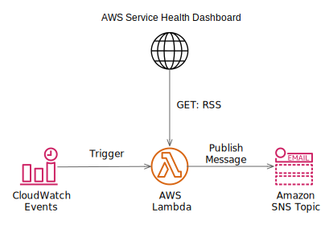

# AWSServiceHealthNotification
Notify the health status of "AWS Transfer for SFTP"  

The AWS Personal Health Dashboard does not support AWS Transfer for SFTP.  
Therefore, the status of the service is obtained from the AWS Service Health Dashboard and notified by email.  


__Operating specifications__
1. AWS Lambda function started by AWS CloudWatch Schedule Event gets information (xml) from AWS Service Health Dashboard.
2. AWS Lambda function sends mail notification using AWS SNS if there is information(item) to be notified in the acquired information (rss).  


  

## Deploying
### Requirements

- AWS Account
- Python 3.7 or greater
- AWS CLI latest

### Instructions

These are the deployment steps until the full implementation is complete.:

Locally, run following commands. 

1. Set variables

UPLOADBUCKETNAME:  
Create S3Bucket to upload Lambda Function in advance.  
Set BucketName to the following UPLOADBUCKETNAME.  

MAILADDRESS:  
Destination address for notifying Service Status.


```bash
$ PROJECTNAME=opstools
$ ROLENAME=healthcheck
$ UPLOADBUCKETNAME=xxxxxxxxxxxx
$ MAILADDRESS=xxxxx@xxx.xxx

```

2. Upload local artifacts  
```bash
$ aws cloudformation package \
    --template-file health_check.yaml \
    --s3-bucket $UPLOADBUCKETNAME \
    --output-template-file packaged.yml
```

3. Deploys the specified AWS CloudFormation template
```bash
$ aws cloudformation deploy \
    --stack-name $PROJECTNAME-$ROLENAME \
    --region ap-northeast-1 \
    --template-file packaged.yml \
    --capabilities CAPABILITY_NAMED_IAM \
    --output text \
    --parameter-overrides \
        NortificationMail=$MAILADDRESS
```


### RSS Sample from [AWS Service Health Dashboard](https://status.aws.amazon.com/)

[RSS: Amazon Elastic Compute Cloud (Tokyo)](https://status.aws.amazon.com/rss/ec2-ap-northeast-1.rss)
  
```xml
<?xml version="1.0" encoding="UTF-8"?>
<rss version="2.0">
  <channel>
    <title><![CDATA[Amazon Elastic Compute Cloud (Tokyo) Service Status]]></title>
    <link>http://status.aws.amazon.com/</link>
    <language>en-us</language>
    <lastBuildDate>Sat, 07 Sep 2019 00:03:14 PDT</lastBuildDate>
    <generator>AWS Service Health Dashboard RSS Generator</generator>
    <description><![CDATA[Amazon Elastic Compute Cloud (Tokyo) Service Status]]></description>
    <ttl>5</ttl>
    <!-- You seem to care about knowing about your events, why not check out https://docs.aws.amazon.com/health/latest/ug/getting-started-api.html -->

	 
	 <item>
	  <title><![CDATA[Service is operating normally: インスタンスの接続性について | Instance Availability]]></title>
	  <link>http://status.aws.amazon.com/</link>
	  <pubDate>Fri, 23 Aug 2019 04:18:35 PDT</pubDate>
	  <guid isPermaLink="false">http://status.aws.amazon.com/#ec2-ap-northeast-1_1566559115</guid>
	  <description><![CDATA[日本時間 2019年8月23日 12:36 より、AP-NORTHEAST-1 の単一のアベイラビリティゾーンで、一定の割合の EC2 サーバのオーバーヒートが発生しました。この結果、当該アベイラビリティゾーンの EC2 インスタンス及び EBS ボリュームのパフォーマンスの劣化が発生しました。このオーバーヒートは、影響を受けたアベイラビリティゾーン中の一部の冗長化された空調設備の管理システム障害が原因です。日本時間 15:21 に冷却装置は復旧し、室温が通常状態に戻り始めました。温度が通常状態に戻ったことで、影響を受けたインスタンスの電源が回復しました。日本時間 18:30 より大部分の EC2 インスタンスと EBS ボリュームは回復しました。 我々は残りの EC2 インスタンスと EBS ボリュームの回復に取り組んでいます。少数の EC2 インスタンスと EBS ボリュームが電源が落ちたハードウェア ホスト上に残されています。我々は影響をうけた全ての EC2 インスタンスと EBS ボリュームの回復のための作業を継続しています。 早期回復の為、可能な場合残された影響を受けている EC2 インスタンスと EBS ボリュームのリプレースを推奨します。いくつかの影響をうけた EC2 インスタンスはお客様側での作業が必要になる可能性がある為、 後ほどお客様個別にお知らせすることを予定しています。&lt;br&gt;&lt;br&gt;詳細は &lt;a href="https://aws.amazon.com/message/56489/"&gt;こちら&lt;/a&gt; をご参照ください。追加のご質問がある場合は、&lt;a href="https://aws.amazon.com/support"&gt;AWS サポート&lt;/a&gt;までご連絡ください。 | Beginning at 8:36 PM PDT a small percentage of EC2 servers in a single Availability Zone in the AP-NORTHEAST-1 Region shutdown due to overheating. This resulted in impaired EC2 instances and degraded EBS volume performance for resources in the affected area of the Availability Zone. The overheating was caused by a control system failure that caused multiple, redundant cooling systems to fail in parts of the affected Availability Zone. The chillers were restored at 11:21 PM PDT and temperatures in the affected areas began to return to normal. As temperatures returned to normal, power was restored to the affected instances. By 2:30 AM PDT, the vast majority of instances and volumes had recovered. We have been working to recover the remaining instances and volumes. A small number of remaining instances and volumes are hosted on hardware which was adversely affected by the loss of power. We continue to work to recover all affected instances and volumes. For immediate recovery, we recommend replacing any remaining affected instances or volumes if possible. Some of the affected instances may require action from customers and we will be reaching out to those customers with next steps.&lt;br&gt;&lt;br&gt;Additional details are available &lt;a href="https://aws.amazon.com/message/56489/"&gt;here&lt;/a&gt;. If you have additional questions, please contact &lt;a href="https://aws.amazon.com/support"&gt;AWS Support&lt;/a&gt;.]]></description>
	 </item>
         
	 <item>
	  <title><![CDATA[Informational message: インスタンスの接続性について | Instance Availability]]></title>
	  <link>http://status.aws.amazon.com/</link>
	  <pubDate>Fri, 23 Aug 2019 02:39:42 PDT</pubDate>
	  <guid isPermaLink="false">http://status.aws.amazon.com/#ec2-ap-northeast-1_1566553182</guid>
	  <description><![CDATA[The majority of impaired EC2 instances and EBS volumes experiencing degraded performance have now recovered. We continue to work on recovery for the remaining EC2 instances and EBS volumes that are affected by this issue. This issue affects EC2 instances and EBS volumes in a single Availability Zone in the AP-NORTHEAST-1 region.]]></description>
	 </item>
         
	 <item>
	  <title><![CDATA[Service degradation: インスタンスの接続性について | Instance Availability]]></title>
	  <link>http://status.aws.amazon.com/</link>
	  <pubDate>Fri, 23 Aug 2019 01:54:51 PDT</pubDate>
	  <guid isPermaLink="false">http://status.aws.amazon.com/#ec2-ap-northeast-1_1566550491</guid>
	  <description><![CDATA[Recovery is in progress for instance impairments and degraded EBS volume performance within a single Availability Zone in the AP-NORTHEAST-1 Region. We continue to work towards recovery for all affected instances and EBS volumes.]]></description>
	 </item>
         
	 <item>
	  <title><![CDATA[Service degradation: インスタンスの接続性について | Instance Availability]]></title>
	  <link>http://status.aws.amazon.com/</link>
	  <pubDate>Thu, 22 Aug 2019 23:40:01 PDT</pubDate>
	  <guid isPermaLink="false">http://status.aws.amazon.com/#ec2-ap-northeast-1_1566542401</guid>
	  <description><![CDATA[We are starting to see recovery for instance impairments and degraded EBS volume performance within a single Availability Zone in the AP-NORTHEAST-1 Region. We continue to work towards recovery for all affected instances and EBS volumes.]]></description>
	 </item>
         
	 <item>
	  <title><![CDATA[Service degradation: インスタンスの接続性について | Instance Availability]]></title>
	  <link>http://status.aws.amazon.com/</link>
	  <pubDate>Thu, 22 Aug 2019 22:27:25 PDT</pubDate>
	  <guid isPermaLink="false">http://status.aws.amazon.com/#ec2-ap-northeast-1_1566538045</guid>
	  <description><![CDATA[We have identified the root cause and are working toward recovery for the instance impairments and degraded EBS volume performance within a single Availability Zone in the AP-NORTHEAST-1 Region.]]></description>
	 </item>
         
	 <item>
	  <title><![CDATA[Informational message: インスタンスの接続性について | Instance Availability]]></title>
	  <link>http://status.aws.amazon.com/</link>
	  <pubDate>Thu, 22 Aug 2019 21:47:25 PDT</pubDate>
	  <guid isPermaLink="false">http://status.aws.amazon.com/#ec2-ap-northeast-1_1566535645</guid>
	  <description><![CDATA[We can confirm that some instances are impaired and some EBS volumes are experiencing degraded performance within a single Availability Zone in the AP-NORTHEAST-1 Region. Some EC2 APIs are also experiencing increased error rates and latencies. We are working to resolve the issue.]]></description>
	 </item>
         
	 <item>
	  <title><![CDATA[Informational message: インスタンスの接続性について | Instance Availability]]></title>
	  <link>http://status.aws.amazon.com/</link>
	  <pubDate>Thu, 22 Aug 2019 21:18:32 PDT</pubDate>
	  <guid isPermaLink="false">http://status.aws.amazon.com/#ec2-ap-northeast-1_1566533912</guid>
	  <description><![CDATA[We are investigating connectivity issues affecting some instances in a single Availability Zone in the AP-NORTHEAST-1 Region.]]></description>
	 </item>
         
	 <item>
	  <title><![CDATA[Informational message: [解決済] APIのエラー率の増加 | [RESOLVED] API Increased API Error Rates]]></title>
	  <link>http://status.aws.amazon.com/</link>
	  <pubDate>Sun, 04 Jun 2017 22:58:04 PDT</pubDate>
	  <guid isPermaLink="false">http://status.aws.amazon.com/#ec2-ap-northeast-1_1496642284</guid>
	  <description><![CDATA[日本時間 午後 2:16 から 午後 2:40 の間、AP-NORTHEAST-1 (東京リージョン)の一つのアベイラビリティーゾーンにおいてEC2 APIのエラー率が増加いたしました。現在は解決しており通常通りご利用いただけます。 | Between 10:16 PM and 10:40 PM PDT we experienced increased error rates for the EC2 APIs in a single Availability Zone in the AP-NORTHEAST-1 Region. The issue has been resolved and the service is operating normally.]]></description>
	 </item>
         
	 <item>
	  <title><![CDATA[Service is operating normally: [RESOLVED] Degraded volume performance for some EBS volumes]]></title>
	  <link>http://status.aws.amazon.com/</link>
	  <pubDate>Tue, 05 Jul 2016 21:24:03 PDT</pubDate>
	  <guid isPermaLink="false">http://status.aws.amazon.com/#ec2-ap-northeast-1_1467779043</guid>
	  <description><![CDATA[Between 8:00 PM and 8:49 PM PDT we experienced degraded performance for a small number of EBS magnetic volumes in a single availability zone in the AP-NORTHEAST-1 Region. The issue has been resolved and the service is operating normally.]]></description>
	 </item>
         
	 <item>
	  <title><![CDATA[Informational message: Degraded volume performance for some EBS volumes]]></title>
	  <link>http://status.aws.amazon.com/</link>
	  <pubDate>Tue, 05 Jul 2016 20:51:36 PDT</pubDate>
	  <guid isPermaLink="false">http://status.aws.amazon.com/#ec2-ap-northeast-1_1467777096</guid>
	  <description><![CDATA[We are investigating degraded performance for a small number of EBS magnetic volumes in a single availability zone in the AP-NORTHEAST-1 Region.]]></description>
	 </item>
         
	 <item>
	  <title><![CDATA[Service is operating normally: [RESOLVED] Increased API Error Rates ]]></title>
	  <link>http://status.aws.amazon.com/</link>
	  <pubDate>Wed, 20 Apr 2016 10:00:00 PDT</pubDate>
	  <guid isPermaLink="false">http://status.aws.amazon.com/#ec2-ap-northeast-1_1461171600</guid>
	  <description><![CDATA[Between 9:18 AM PDT and 9:38 AM PDT, we experienced increased API error rates in the AP-NORTHEAST-1 Region. This issue has been resolved and the service is operating normally. ]]></description>
	 </item>
         
	 <item>
	  <title><![CDATA[Service is operating normally: [RESOLVED] Increased API Error Rates ]]></title>
	  <link>http://status.aws.amazon.com/</link>
	  <pubDate>Wed, 20 Apr 2016 09:39:00 PDT</pubDate>
	  <guid isPermaLink="false">http://status.aws.amazon.com/#ec2-ap-northeast-1_1461170340</guid>
	  <description><![CDATA[We are investigating increased API error rates in the AP-NORTHEAST-1 Region.]]></description>
	 </item>
         
	 <item>
	  <title><![CDATA[Service is operating normally: [RESOLVED] Increased API Errors]]></title>
	  <link>http://status.aws.amazon.com/</link>
	  <pubDate>Sun, 28 Jun 2015 22:01:28 PDT</pubDate>
	  <guid isPermaLink="false">http://status.aws.amazon.com/#ec2-ap-northeast-1_1435554088</guid>
	  <description><![CDATA[Between 9:14 PM and 9:53 PM PDT we experienced increased error rates and latencies for the EC2 APIs in a single Availability Zone in the AP-NORTHEAST-1 Region. The issue has been resolved and the service is operating normally.]]></description>
	 </item>
         
	 <item>
	  <title><![CDATA[Informational message: Increased API Errors]]></title>
	  <link>http://status.aws.amazon.com/</link>
	  <pubDate>Sun, 28 Jun 2015 21:37:30 PDT</pubDate>
	  <guid isPermaLink="false">http://status.aws.amazon.com/#ec2-ap-northeast-1_1435552650</guid>
	  <description><![CDATA[We are investigating increased error rates and latencies for the EC2 APIs in the AP-NORTHEAST-1 Region.]]></description>
	 </item>
         
	 <item>
	  <title><![CDATA[Service is operating normally: [RESOLVED] Network connectivity]]></title>
	  <link>http://status.aws.amazon.com/</link>
	  <pubDate>Fri, 15 May 2015 08:36:27 PDT</pubDate>
	  <guid isPermaLink="false">http://status.aws.amazon.com/#ec2-ap-northeast-1_1431704187</guid>
	  <description><![CDATA[[RESOLVED] Between 4:33 AM and 8:14 AM PDT we experienced connectivity issues affecting some instances in a single Availability Zone in the AP-NORTHEAST-1 Region. Instances within the Availability Zone affected by this issue experienced elevated packet loss on connections to the Internet and other instances within the Region. The issue has been resolved and the service is operating normally.]]></description>
	 </item>
        
  </channel>
</rss>
```